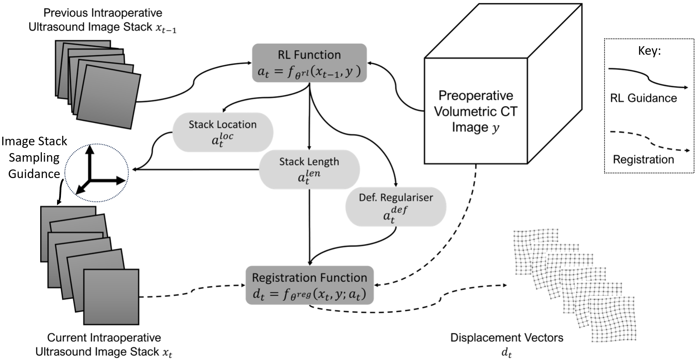
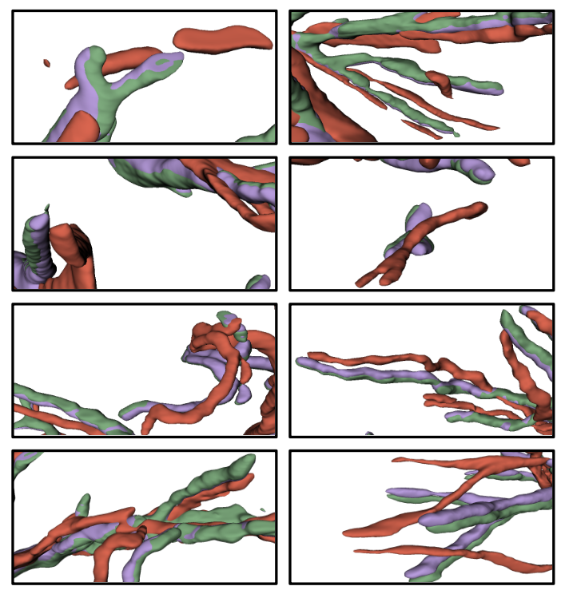

# Guided ultrasound acquisition for nonrigid image registration using reinforcement learning

Authors: Shaheer U. Saeed [a,∗], Joao Ramalhinho [a], Nina Montana-Brown [a], Ester Bonmati [a,b], Stephen P. Pereira [c], Brian Davidson [d], Matthew J. Clarkson [a], Yipeng Hu [a]

[a] Centre for Medical Image Computing, Wellcome/EPSRC Centre for Interventional & Surgical Sciences, and Department of Medical Physics & Biomedical Engineering, University College London, London, UK
[b] School of Computer Science and Engineering, University of Westminster, London, UK
[c] Institute for Liver and Digestive Health, University College London, London, UK
[d] Division of Surgery & Interventional Science, University College London, London, UK

[*] shaheer.saeed.17@ucl.ac.uk

We propose a guided registration method for spatially aligning a fixed preoperative image and untracked ultrasound image slices. We exploit the unique interactive and spatially heterogeneous nature of this application to develop a registration algorithm that interactively suggests and acquires ultrasound images at optimised locations (with respect to registration performance). Our framework is based on two trainable functions: 1) a deep hyper-network-based registration function, which is generalisable over varying location and deformation, and adaptable at test-time; 2) a reinforcement learning function for producing test-time estimates of image acquisition locations and adapted deformation regularisation (the latter is required due to varying acquisition locations). We evaluate our proposed method with real preoperative patient data, and simulated intraoperative data with variable field-of-view. We report statistically significant improvements in overall registration performance across a variety of metrics for our proposed method, compared to registration without acquisition guidance or adaptable deformation regularisation, and to commonly used classical iterative methods and learning-based registration. For the first time, efficacy of proactive image acquisition is demonstrated in a surgical interventional registration, in contrast to most existing work addressing registration post-data-acquisition, one of the reasons we argue may have led to previously under-constrained nonrigid registration in such applications.

